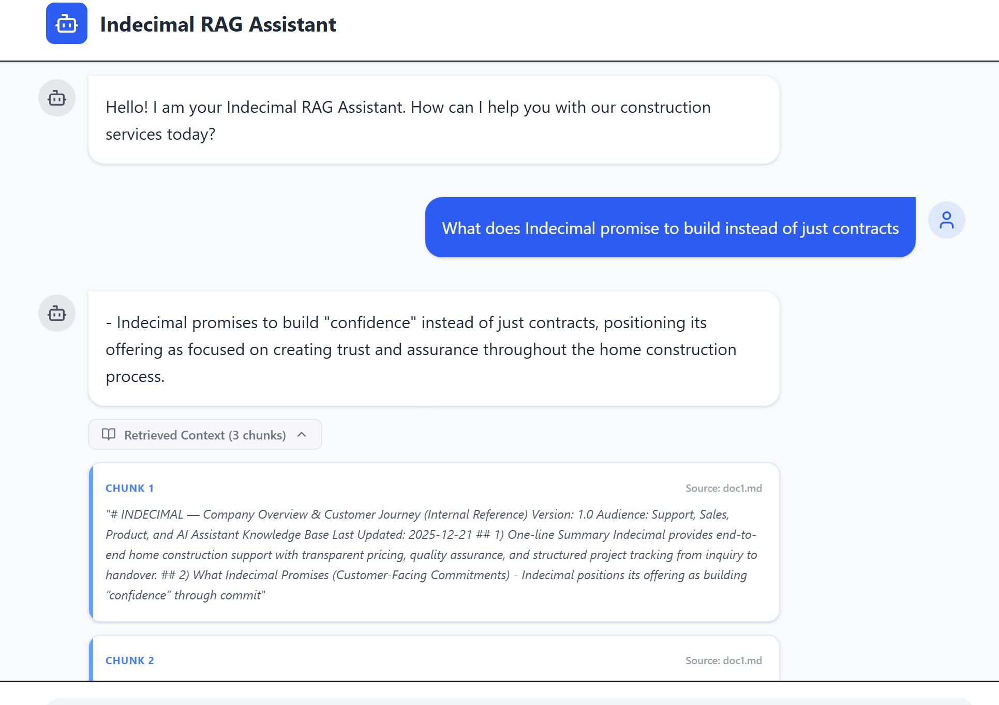
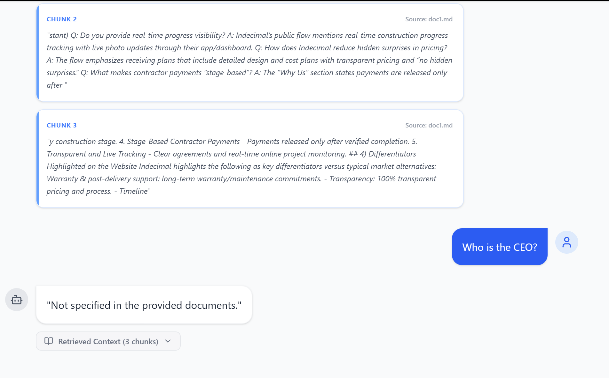
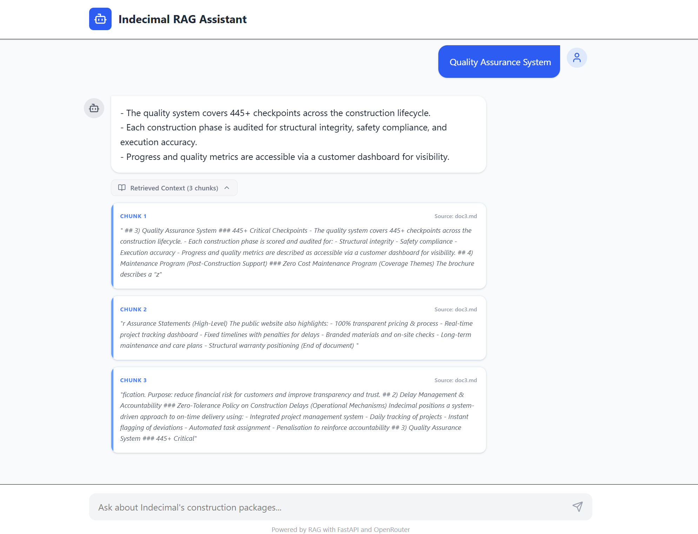
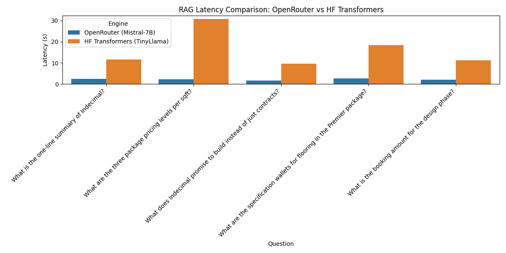

# 🏗️ Mini RAG System – Construction Knowledge Assistant

A full-stack **Retrieval-Augmented Generation (RAG)** system built for a construction marketplace to answer queries using internal documents (policies, FAQs, specifications) with strict grounding and zero hallucination.

---

## 🚀 Live Features



* 💬 Chatbot interface for querying construction knowledge
* 📄 Answers strictly grounded in internal documents
* 🔍 Transparent retrieval (shows source chunks)
* ⚡ Fast cloud inference + local model fallback
* 📊 Performance comparison (OpenRouter vs Local LLM)

---

## 🧠 System Architecture

```
Documents → Chunking → Embeddings → FAISS Vector Store
                                           ↓
User Query → Embedding → Top-K Retrieval → LLM → Answer
```

---

## 📂 Tech Stack

### Backend

* FastAPI
* FAISS (vector search)
* sentence-transformers (embeddings)
* OpenRouter (Mistral-7B)
* HuggingFace Transformers (TinyLlama - local)

### Frontend

* React (Vite)
* Tailwind CSS

---

## 📄 Document Processing

* Input: Internal PDF documents (construction policies/specs)
* Chunking strategy:

  * Size: 300–700 tokens
  * Overlap: 50–150 tokens
* Each chunk stored with metadata:

  * document name
  * chunk id

---

## 🧠 Embedding Model

* **Model:** `all-MiniLM-L6-v2`
* **Why chosen:**

  * Fast and lightweight
  * Good semantic similarity performance
  * Suitable for real-time RAG systems

---

## 🗂️ Vector Retrieval

* Vector DB: **FAISS**
* Similarity: L2 distance
* Retrieval: Top-k (k = 3)
* Ensures relevant context selection for each query

---

## 🤖 LLM Answer Generation

### Models Used:

* **OpenRouter (Mistral-7B)** – Primary
* **TinyLlama (HuggingFace, local CPU)** – Comparison

### Grounding Strategy:

* Strict prompt constraint:

  * Answer ONLY using retrieved context
  * No external knowledge allowed
  * If missing → return: `"Not specified in the provided documents."`

---

## 🔍 Transparency & Explainability

Each response includes:

* ✅ Retrieved document chunks
* ✅ Source file references
* ✅ Final generated answer

This ensures:

* No hallucination
* Full traceability of answers

---

## 📊 Performance Evaluation

### 🔹 Latency Comparison


| Engine                  | Avg Latency | Groundedness |
| ----------------------- | ----------- | ------------ |
| OpenRouter (Mistral-7B) | ~2.1s       | High         |
| Local LLM (TinyLlama)   | ~20.8s      | Low          |

### 🔹 Key Observations

* OpenRouter is **~8–10x faster**
* OpenRouter strictly follows grounding rules
* Local LLM:

  * Slower on CPU
  * Prone to hallucination

Example failure:

* Predicted **₹370 cement price** as booking amount ❌
* Invented document dates ❌

Detailed evaluation: 

---

## 🧪 Evaluation Methodology

* Created 10 test queries from documents
* Evaluated on:

  * Retrieval relevance
  * Answer correctness
  * Hallucination presence
  * Completeness

---

## 🚀 Run with Streamlit (Alternative UI)

If you prefer a pure Python interface, you can run the system using Streamlit:

1. Navigate to the backend directory:
   ```bash
   cd backend
   ```
2. Run the Streamlit app:
   ```bash
   streamlit run streamlit_app.py
   ```
3. The UI will be available at `http://localhost:8501`.

---

## 🛠️ Local Setup & Running

### 1. Prerequisites
* Python 3.10+
* Node.js & npm

### 2. Backend Setup
1. Navigate to the backend directory:
   ```bash
   cd backend
   ```
2. Create and activate a virtual environment:
   ```bash
   python -m venv venv
   # On Windows:
   .\venv\Scripts\activate
   # On macOS/Linux:
   source venv/bin/activate
   ```
3. Install dependencies:
   ```bash
   pip install -r requirements.txt
   ```
4. Create a `.env` file and add your OpenRouter API key:
   ```env
   OPENROUTER_API_KEY=your_api_key_here
   PORT=8000
   ```
5. Place your PDF/Markdown documents in the `backend/data` folder.
6. Run the server:
   ```bash
   uvicorn main:app --host 0.0.0.0 --port 8000 --reload
   ```

### 3. Frontend Setup
1. Navigate to the frontend directory:
   ```bash
   cd frontend
   ```
2. Install dependencies:
   ```bash
   npm install
   ```
3. Run the development server:
   ```bash
   npm run dev
   ```
4. Open your browser at `http://localhost:5173`.

---

## 🚀 Deployment Guide

### 🔹 Backend (Render)
1.  **Create a New Web Service** on [Render](https://render.com/).
2.  **Connect your GitHub repository**.
3.  **Configure Settings**:
    - **Root Directory**: `backend`
    - **Environment**: `Python 3`
    - **Build Command**: `pip install -r requirements.txt`
    - **Start Command**: `python -m uvicorn main:app --host 0.0.0.0 --port $PORT`
4.  **Add Environment Variables**:
    - `OPENROUTER_API_KEY`: Your OpenRouter API key.
    - `ENVIRONMENT`: `production`
    - `FRONTEND_URL`: Your Vercel frontend URL (e.g., `https://your-app.vercel.app`).
    - `DATA_DIR`: `data`

### 🔹 Frontend (Vercel)
1.  **Create a New Project** on [Vercel](https://vercel.com/).
2.  **Connect your GitHub repository**.
3.  **Configure Project**:
    - **Framework Preset**: `Vite`
    - **Root Directory**: `frontend`
4.  **Add Environment Variables**:
    - `VITE_API_BASE_URL`: Your Render backend URL (e.g., `https://your-backend.onrender.com`).
5.  **Build and Deploy**.

---

## 📌 API Endpoint

```
GET /chat?query=...
```

Response:

```json
{
  "query": "...",
  "retrieved_context": [...],
  "answer": "..."
}
```

---

## ⭐ Key Features

* Strict grounded RAG (zero hallucination design)
* Cross-model support (cloud + local)
* Transparent answer generation
* Clean, modern chatbot UI
* Performance benchmarking included

---

## 🔥 Bonus Implementations

* ✅ Multi-model comparison (OpenRouter vs Local LLM)
* ✅ Latency benchmarking + visualization
* ✅ Hallucination analysis
* ✅ Source-aware responses

---

## ⚠️ Limitations

* Local LLM performance limited on CPU
* Retrieval depends on chunk quality
* No reranking layer (future improvement)

---

## 🚀 Future Improvements

* Add reranking (cross-encoder)
* Introduce similarity threshold filtering
* Highlight relevant spans in UI
* Add confidence scoring

---

## 💡 Conclusion

This system demonstrates a **robust, explainable RAG pipeline** that prioritizes:

* correctness
* transparency
* grounded reasoning

It effectively balances **performance (OpenRouter)** and **flexibility (local LLMs)** for real-world deployment.

---
