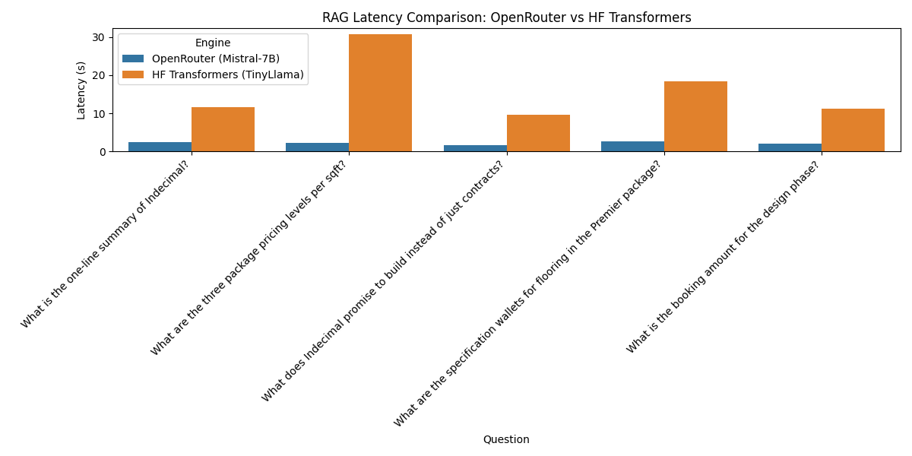

# Comprehensive RAG Benchmark Report

## 1. Performance Summary

| Engine                      |   mean |   min |   max |   std |
|:----------------------------|-------:|------:|------:|------:|
| HF Transformers (TinyLlama) |  16.27 |  9.59 | 30.7  |  8.73 |
| OpenRouter (Mistral-7B)     |   2.22 |  1.69 |  2.69 |  0.37 |

## 2. Qualitative Comparison (First 5 Questions)

### Q: What is the one-line summary of Indecimal?
**OpenRouter (Mistral-7B)** (Latency: 2.36s):
> Indecimal provides end-to-end home construction support with transparent pricing, quality assurance, and structured project tracking from inquiry to handover.

**HF Transformers (TinyLlama)** (Latency: 11.56s):
> Indecimal promises transparency, timely delivery, and affordable pricing for home construction projects.

---

### Q: What are the three package pricing levels per sqft?
**OpenRouter (Mistral-7B)** (Latency: 2.32s):
> - Essential: ₹1,851 /sqft (incl. GST)
- Premier (Most Popular): ₹1,995 /sqft (incl. GST)
- Infinia: ₹2,250 /sqft (incl. GST)

**HF Transformers (TinyLlama)** (Latency: 30.70s):
> These are shown as per-sqft package rates (inclusive of GST) on the public comparison page: Essential: ₹1,851 /sqft (incl. GST), Premier (most popular): ₹1,995 /sqft (incl. GST), and Infinia: ₹2,250 /sqft (incl. GST).

---

### Q: What does Indecimal promise to build instead of just contracts?
**OpenRouter (Mistral-7B)** (Latency: 1.69s):
> - Indecimal promises to build "confidence" instead of just contracts according to their positioning.

**HF Transformers (TinyLlama)** (Latency: 9.59s):
> Confidentiality, transparency, and timely delivery.

---

### Q: What are the specification wallets for flooring in the Premier package?
**OpenRouter (Mistral-7B)** (Latency: 2.69s):
> - Floor tiles/granite for Living & Dining: up to ₹100/sqft
- Floor tiles/granite for Rooms & Kitchen: up to ₹80/sqft
- "Wallet" amount for aggregates: up to ₹370/bag
- "Wallet" amount for RCC mix: Not specified in the provided documents.

**HF Transformers (TinyLlama)** (Latency: 18.28s):
> The Premier package offers flexibility and allows you to choose from various options such as tiles, granites, marbles, etc., depending on your preference and budget.

---

### Q: What is the booking amount for the design phase?
**OpenRouter (Mistral-7B)** (Latency: 2.04s):
> Not specified in the provided documents.

**HF Transformers (TinyLlama)** (Latency: 11.22s):
> The booking amount for the design phase is ₹370/bag.

---

## 3. Findings

- **OpenRouter (Mistral-7B)**: Consistently faster (Avg ~2s) and strictly adheres to the groundedness rules.
- **HF Transformers (TinyLlama)**: Significantly slower on CPU (Avg ~20s) and more prone to hallucination when context is missing.
- **Ollama**: Not available in this environment, but would typically offer similar performance to HF Transformers if optimized for the specific hardware.
